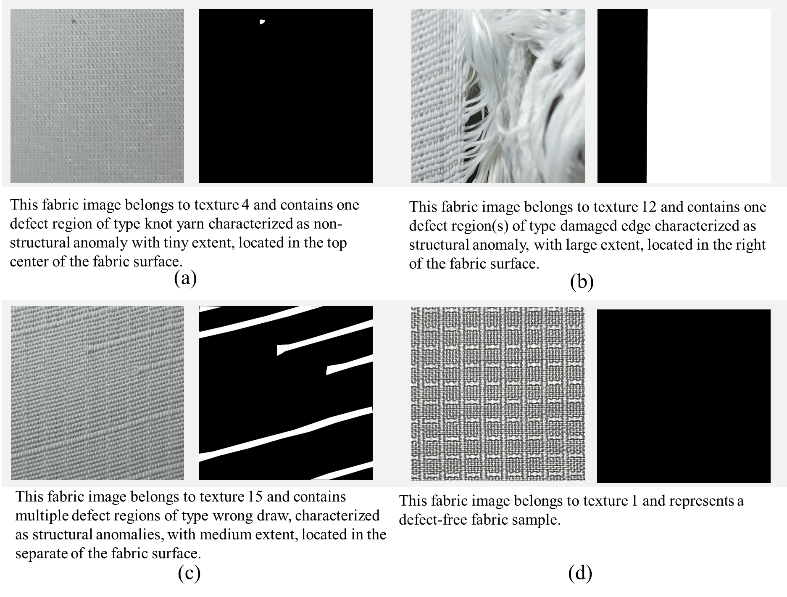
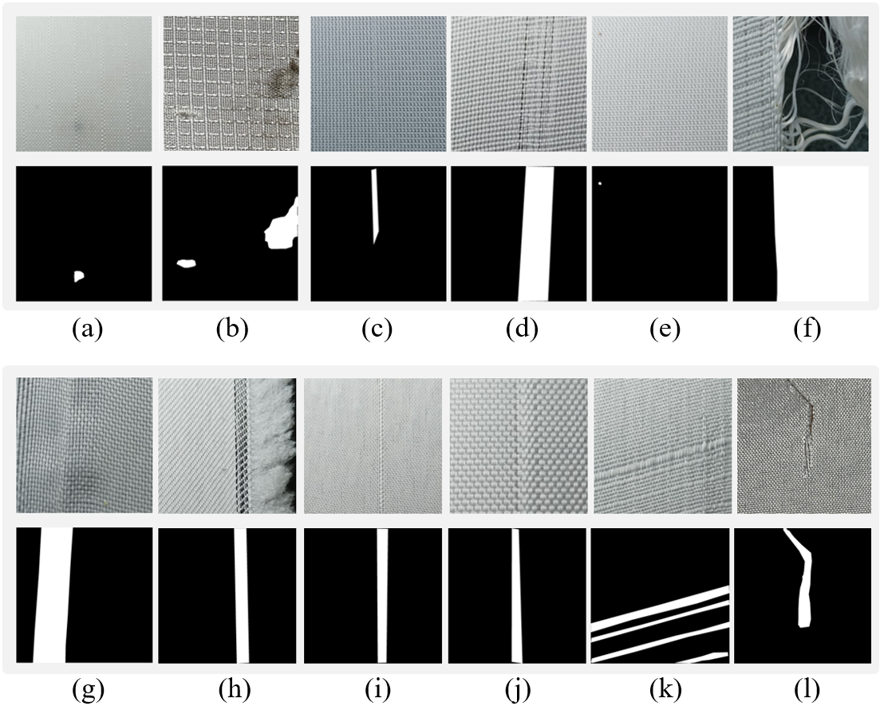
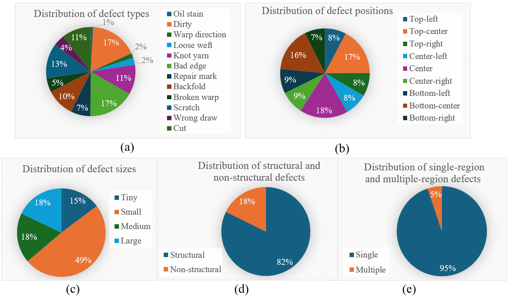
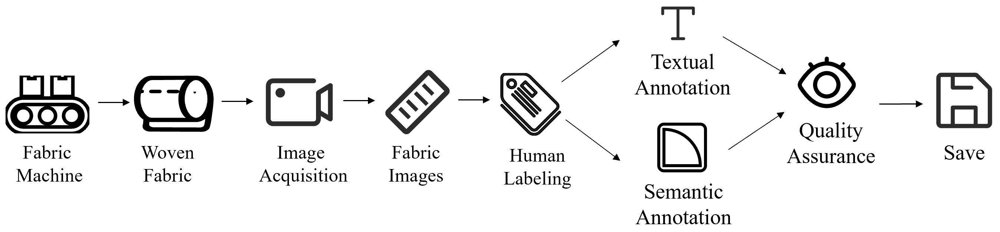
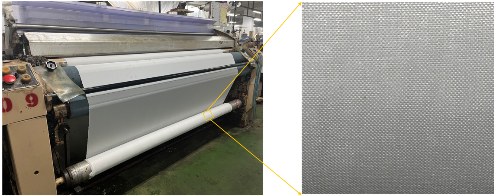

# LangFabric

**LangFabric: A Language-Annotated Multimodal Fabric Dataset for Fabric Defect Detection**

LangFabric is a language-annotated multimodal fabric dataset collected from real textile manufacturing environments for fabric defect detection research.  
It is designed to support both conventional visual inspection tasks and emerging multimodal learning tasks.

---

## Overview

LangFabric provides:

- high-resolution fabric images
- pixel-level segmentation masks for defective samples
- structured textual descriptions paired with images
- predefined train/test splits for downstream evaluation

The dataset contains **6,384 paired samples**, covering **16 fabric texture categories** and **12 defect categories**.  
Among them, **5,794** are normal samples and **590** are defective samples.

<!-- Figure 2 -->


*Figure 2. Examples of fabric images, pixel-level segmentation masks, and corresponding textual descriptions in the LangFabric dataset.*

---

## Dataset Highlights

- **6,384 paired image-text samples**
- **16 texture categories**
- **12 defect categories**
- **5,794 normal images**
- **590 defective images**
- **pixel-level masks for defect localization**
- **structured textual annotations for multimodal learning**

LangFabric supports:

- supervised defect detection
- pixel-level segmentation
- anomaly detection
- one-class learning
- image-text alignment
- semantic-guided defect localization
- multimodal industrial anomaly analysis

---

## Fabric Texture Types

LangFabric includes **16 distinct fabric texture categories**, covering a wide range of structural weaving patterns and visual appearances. These textures range from regular grid-like patterns to fine-grained plain weaves and more complex repetitive motifs.

<!-- Figure 7 -->


*Figure 7. Examples of fabrics with different texture types from the LangFabric dataset.*

---

## Defect Categories

LangFabric includes **12 defect categories**:
1. Oil Stain
2. Dirty 
3. Warp Direction  
4. Loose Weft  
5. Knot Yarn  
6. Bad Edge  
7. Repair Mark  
8. Backfold  
9. Broken Warp  
10. Scratch  
11. Wrong Draw  
12. Cut  
 

These defect categories include both:

- **Structural anomalies**, which alter the woven structure
- **Non-structural anomalies**, which mainly appear as surface contamination or irregularities

<!-- Figure 6 -->


*Figure 6. Defective fabric images and their corresponding ground-truth segmentation masks for the 12 defect categories.*

---

## Data Modalities

Each sample in LangFabric includes one or more of the following modalities:

- **Image modality**: fabric image in `.jpg`
- **Text modality**: paired textual description in `.txt`
- **Segmentation modality**: pixel-level defect mask in `.png` for defective samples

### Text Prompt Templates

For normal samples:

```text
This fabric image belongs to the [fabric texture category] and represents a defect-free fabric sample.
```

For defective samples:

```text
This fabric image belongs to the [fabric texture category] and contains [one/multiple] defect region(s) of type [defect category], characterized as [structural/non-structural] anomaly(ies), with [tiny/small/medium/large] extent, located the following positions of the fabric surface: [specified spatial position(s)].
```

These textual descriptions encode defect category, structural property, defect extent, and spatial position.


## Defect Size Definition

Defect sizes are divided into four levels:

- **Tiny**: less than 0.5% of image area
- **Small**: 0.5%–10%
- **Medium**: 10%–30%
- **Large**: more than 30%

---

## Directory Structure

LangFabric is organized into two main folders: `normal/` and `defect/`.  
Each normal sample includes an image and a text file.  
Each defective sample includes an image, a segmentation mask, and a text file.

```text
LangFabric/
├── normal/
│   ├── T1-D0-001.jpg
│   ├── T1-D0-001.txt
│   ├── ...
├── defect/
│   ├── T1-D1-001.jpg
│   ├── T1-D1-001.png
│   ├── T1-D1-001.txt
│   ├── ...
```

*Directory structure of LangFabric.*

---

## File Naming Rule

Files follow the naming convention:

```text
T{texture_id}-D{defect_id}-{sample_id}.{ext}
```

where:

- `T{texture_id}` indicates the fabric texture category (`T1`–`T16`)
- `D{defect_id}` indicates the defect status and defect category
  - `D0`: normal sample
  - `D1`–`D12`: defect categories
- `{sample_id}` is the sample index
- `{ext}` is the file extension (`jpg`, `png`, or `txt`)

---

## Data Distribution

LangFabric reflects realistic industrial production conditions, where normal samples substantially outnumber defective samples.  
The dataset also records distributions over defect type, defect position, defect size, structural vs. non-structural defects, and single-region vs. multiple-region defects.

<!-- Figure 8 -->


*Figure 8. Statistical distributions of the LangFabric dataset.*

---

## Data Acquisition

The dataset was collected from real textile manufacturing environments.  
Fabric images were captured inline during production using a camera mounted above the moving fabric surface.  
Images were resized to a uniform resolution, and manual annotation was performed for both textual descriptions and pixel-level segmentation masks.

<!-- Figure 3 -->


*Figure 3. Construction pipeline of the LangFabric dataset.*

<!-- Figure 4 -->


*Figure 4. Illustration of the production equipment and representative fabric images captured during the manufacturing process.*

---

## Supported Tasks

LangFabric can be used for:

- supervised fabric defect detection
- pixel-level defect segmentation
- industrial anomaly detection
- one-class learning
- multimodal image-text alignment
- semantic-aware defect analysis
- prompt-based vision-language research

---

## Data Availability

The LangFabric dataset is publicly available via **Figshare**:

**DOI:** https://doi.org/10.6084/m9.figshare.29573381

---

## License

LangFabric is released for academic and research use.  
Please cite our paper if you use this dataset in your work.

---

## Citation

```bibtex
@dataset{ni2026langfabric,
  author    = {Yan-Qin Ni and Pei-Kai Huang and Tz-Gang Wang and Wei-Jen Wang and Deron Liang and Chia-Yu Lin},
  title     = {LangFabric: A Language-Annotated Multimodal Fabric Dataset for Fabric Defect Detection},
  year      = {2026},
  publisher = {figshare},
  doi       = {10.6084/m9.figshare.29573381},
  url       = {https://doi.org/10.6084/m9.figshare.29573381}
}
```
